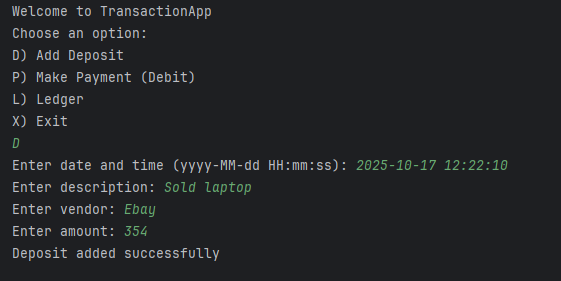
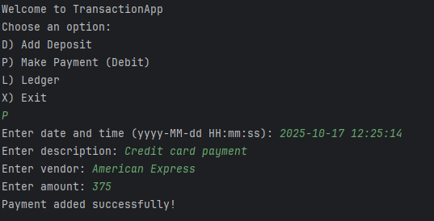
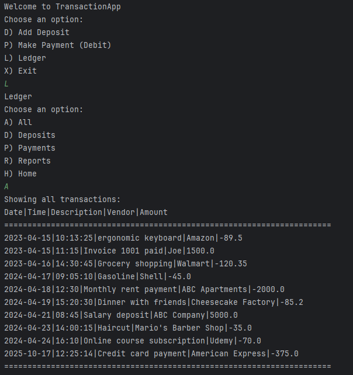
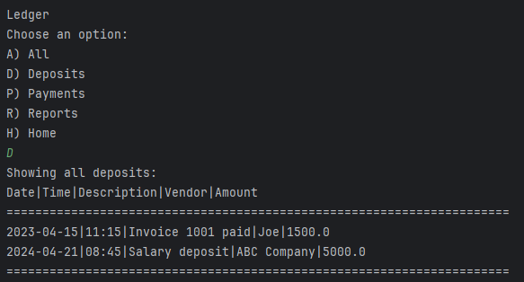
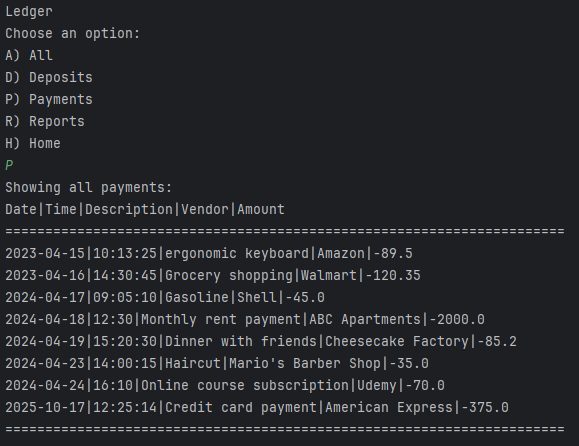
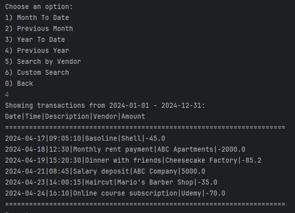
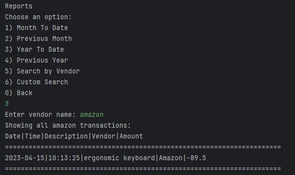

# Financial Tracker

## Description of the Project

Financial Tracker is a Java console application designed to help 
users efficiently manage and analyze their financial transactions. 
The program allows users to record, view, and filter transactions based 
on various criteria such as date, amount, or category.

## User Stories

- As a user, I want to record a deposit so that I can track income or money received.
- As a user, I want to record a payment so that I can track expenses and outgoing money.
- As a user, I want the app to load my existing transactions when I start the program so that I can see my current financial records.
- As a user, I want to view all transactions in the ledger so that I can review all my financial activity.
- As a user, I want to view only payments so that I can track expenses separately from income.
- As a user, I want to view only deposits so that I can easily see my income sources.
- As a user, I want to search for transactions by vendor name so that I can see all purchases or payments to a specific vendor.
- As a user, I want to filter my search from month to date, previous month, year to date, and previous year so I can analyze my financial history
## Setup

Instructions on how to set up and run the project using IntelliJ IDEA.

### Prerequisites

- IntelliJ IDEA: Ensure you have IntelliJ IDEA installed, which you can download from [here](https://www.jetbrains.com/idea/download/).
- Java SDK: Make sure Java SDK (version 17 or above) is installed and properly configured in IntelliJ.

### Running the Application in IntelliJ

Follow these steps to get your application running within IntelliJ IDEA:

1. Open IntelliJ IDEA.
2. Select "Open" and navigate to the directory where you cloned or downloaded the project.
3. After the project opens, wait for IntelliJ to index the files and set up the project.
4. Find the main class with the `public static void main(String[] args)` method.
5. Right-click on the file and select 'Run 'YourMainClassName.main()'' to start the application.

## Technologies Used

- Java 17
- File I/O (java.io package)
- Scanner
- File Writer
- java.time package

## Demo

## Future Work

- Implement a graphical user interface
- Include data export options (CSV, PDF).
- Add budget tracking and reporting features.

## Resources

- [Java Programming Tutorial](https://www.example.com)
- [Effective Java](https://www.example.com)
- [Class LocalDate](https://docs.oracle.com/javase/8/docs/api/java/time/LocalDate.html)

## Thanks

- Thank you to Ray Maroun for continuous support and guidance.

